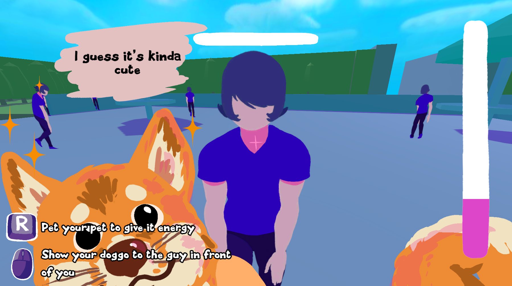
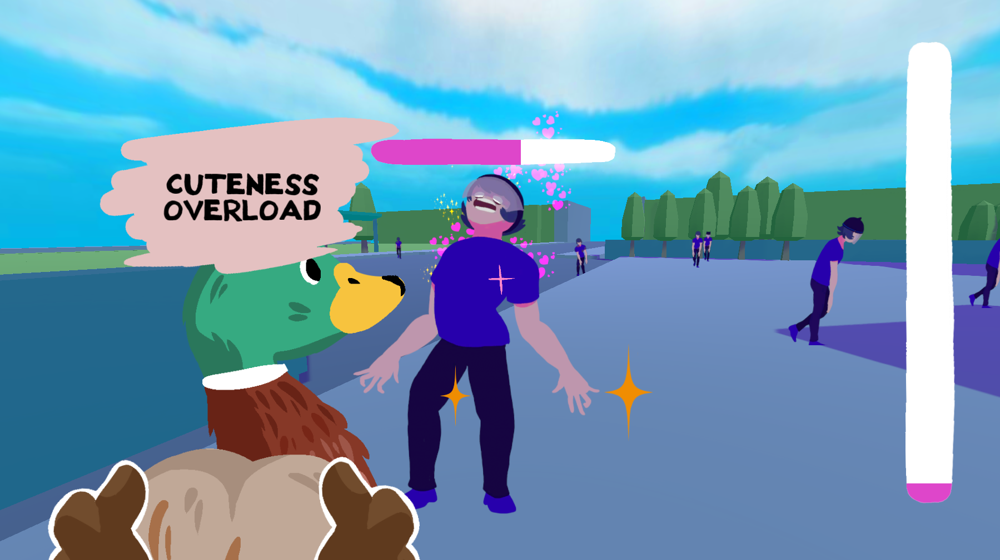

+++
title = 'Cuteness Overload'
date = 2022-02-21T03:35:54+01:00
categories = ["Jams"]
description = "MON TOUTOU EST TROP MIGNON REGARDEZ-LEEEEE, JE VAIS LE MONTRER A TOUT LE MONDE, TROP MIGNOOOONN. Oh. La personne est morte d'une overdose de mignonité. Oh."
image = "thumb.png"
+++

  

Un doom-like à l'ancienne où votre arme est votre animal de compagnie, et les dégâts sont l'amour. Vous avez le choix entre deux armes : un bo toutou trop mims le toutou oh oui, et un pôtit canard trop choupi quack quack le cannou. (Le chat n'est pas une option, ne demandez pas).

J'ai réuni une équipe d'amis proches et nous avons créé un jeu en deux jours ! Le hic, c'est que ces amis n'avaient jamais fait de jeux. Ils ont été très bons, à l'écoute et désireux d'apprendre, et étant donné que j'étais le seul à avoir une idée de la façon de créer un jeu, je pense que nous nous en sommes plutôt bien sortis.

[Jouez ici] (https://clement-o.itch.io/cuteness-overload)