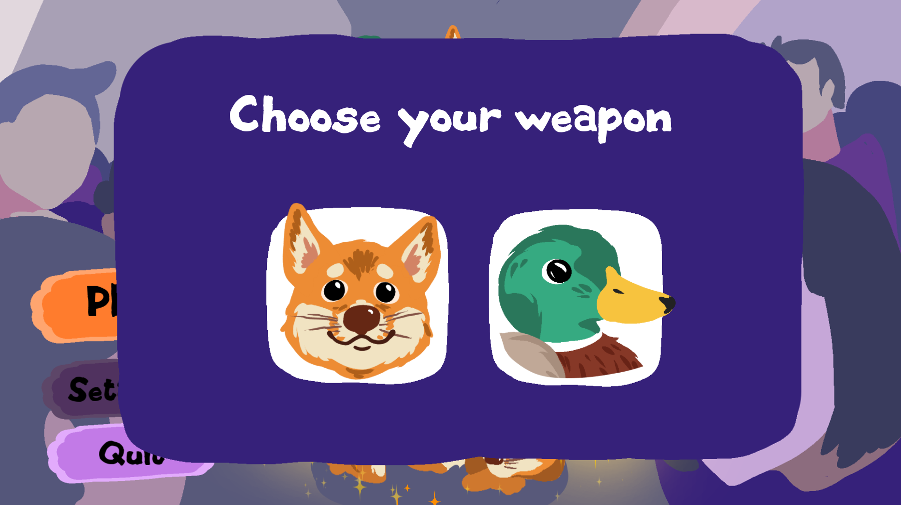
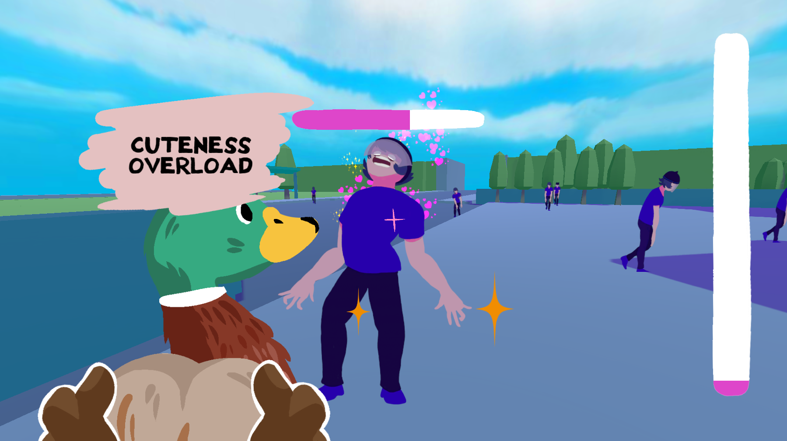

+++
title = 'Cuteness Overload'
date = 2022-02-21T03:35:54+01:00
categories = ["Jams"]
description = "YOUR PET IS SO CUTE, SHOW IT TO EVERYONE, LOOK HOW CUTE IT ISSSSSSSS. Oh. They died of cuteness overload. Oh."
image = "thumb.png"
+++

  

An old-school doom-like where your weapon is your pet, and the damage is love. Choose between two weapons : a cute doggy-dog, or a so-cute quack quack ducky. (Cat isn't an option, don't ask)

I gathered a team of close friends and we made a game in two days! The twist was that those friends never made games and I had to tutor them. They were very good, listening and willing to learn, and considering I was the only one who had a clue on how to make a game, I think we did pretty well.

[Play the game here](https://clement-o.itch.io/cuteness-overload)