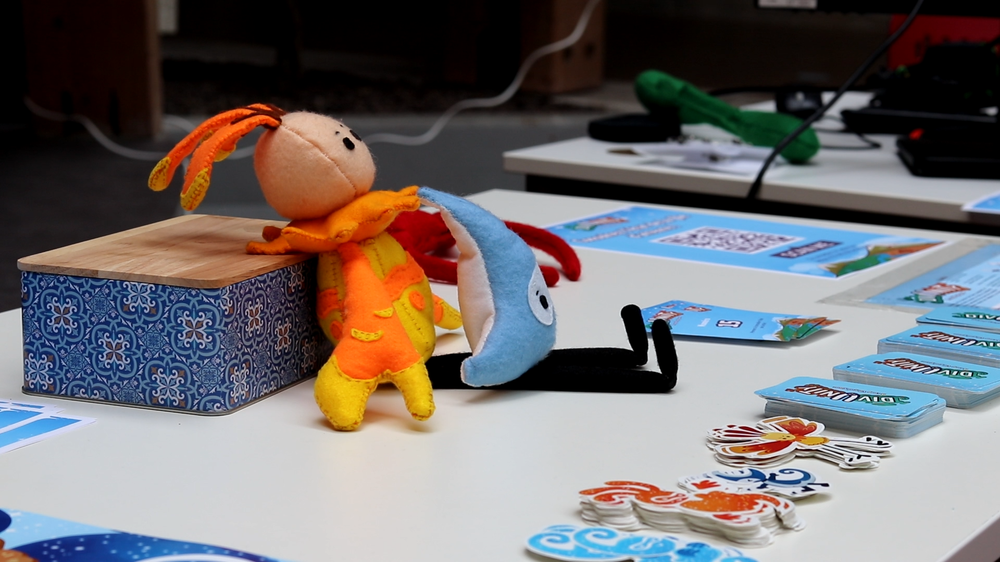
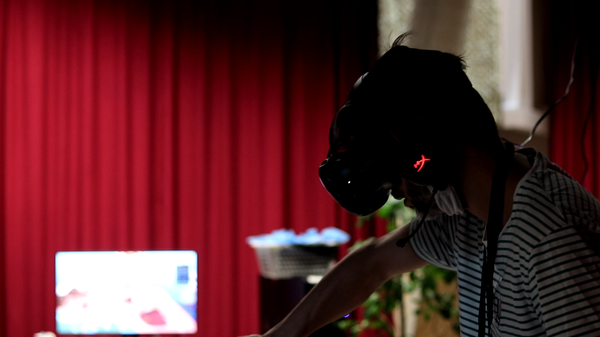
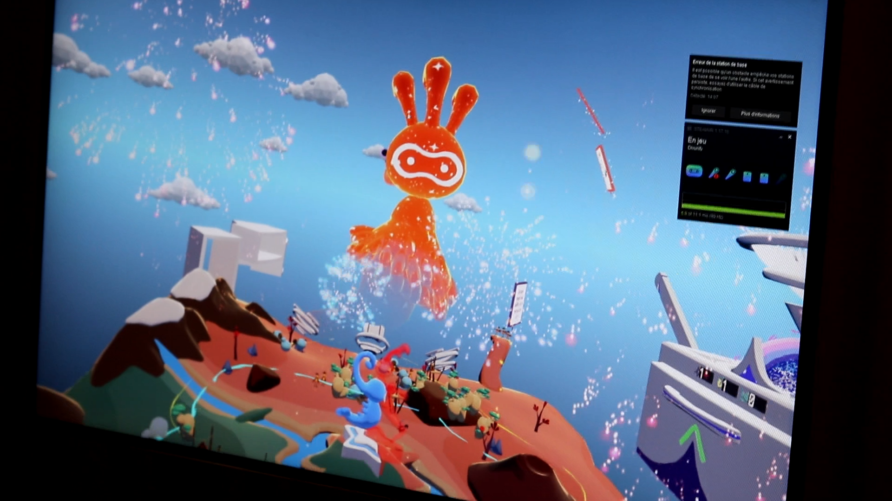
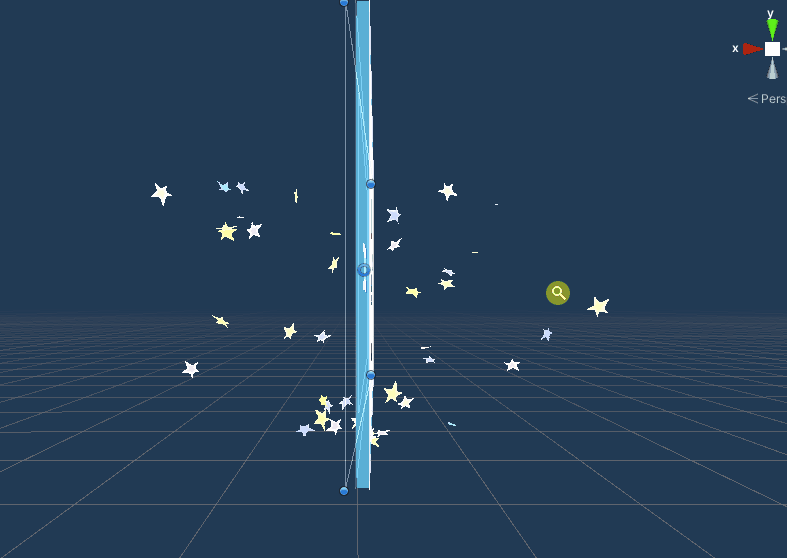

+++
title = 'Divunity'
description = "The very first cooperative VR god-game. A unique experience where players have to make their people live together."
date = 2021-05-24T19:43:55+01:00
draft = false
image = "thumbnail.png"
toc = true
keywords = ["vr", "game dev", "game design", "portfolio", "coop", "indie"]
readingTime = true
categories = ["Projects", "Portfolio"]
+++

Divunity is quite the unique experience. 
It's a VR god game where two players have to cooperate to make their people live together despite hating each other. 
The focus is both on the communication/strategy aspect and the inherent pleasure to play with a VR toy.


# Showcase

This video introduces the gameplay mechanics, and later shows a playthrough.



# From concept to delivery

I had the chance to pitch this idea in front of my colleagues, and for it to be selected among the 12 projects we would create. 

It all started with a clear vision a few colleagues and I had back in 2019. From it came a crude game concept I made to showcase the key concepts. From there, a team of 4 people and I developed a demo in the span of three months, including networking and physics.

We then presented this game to the public, and this massive amount of new players brought to light some of the shortcomings of the design and other UX problems. VR is no easy feat! If this would turn into a full game, we'd have loads of content and improvements to add. We learned a ton and had a blast making it.

**My roles on the project :**
* Game designer
* Gameplay programmer
* Team leader

# Brought to you by

| Credit                | Role                              |
|:---------------------:|:---------------------------------:|
| [Pierre Aceituno](https://www.linkedin.com/in/pierre-aceituno-a5b8b2154/)   | Producer                          |
| Clément Orlandini | Game Designer, programmeur|
| [Solène Pobelle](https://www.linkedin.com/in/solene-pobelle/)    | Character and environment artist  |
| [Noé Simon](https://www.linkedin.com/in/noe-simon/)         | UX Designer, User Researcher      |
| [Pamphile Saltel](https://www.linkedin.com/in/pamphile-saltel/)   | Programmer                        |

The original idea was imagined and playtested by Marie Abrino, Sohel Bourgeau, Hippolyte Follenfant, Morgan Geniez and myself.

# Gallery
    

-----

# Feature Highlight: The Requests system

I designed, prototypes and integrated this game system from start to finish. During the game, your people will ask you new buildings.
It was my favorite feature to work on, as it included element of systems design, technical design, level design and narrative design.

In the first iteration, requests were rudimentary, they would just show a building type, and an action: build or destroy. It didn't offer much variety and so felt boring. Also, players didn't really understand the goal of the game, and the impact of their action on their people's beliefs.

Then, we overhauled the system to include a full sentence of what the people asked you to do, with a crafting hint on the back. This allowed for more ambiguity and player choice. For example, if your people say "We're scared of the other people, do something", then you have two options : 
* Build a guard tower in order to make them feel safe
* Ask your teammate to destroy their guard tower, so your people don't feel threatened.



This opened the door to much more diverse requests, and made the stakes of the game really clear to the players.

Requests are procedurally generated based on the state of the game, like the score of each players or which buildings are in-game. Most of the late-game buildings (when the two tribes like each other more) require you to use resources from your partner, enhancing the cooperation both in the game's narration and in the gameplay.

The game concludes by the two players having to build a "Wonder", a statue in two parts, each player having to build their own part.

```cs
// Sample code of a request

// We built convenience helpers to evaluate the state of the game, for example 
// IsMilitary : Whether the game is in the military age, aka both people hate each other
new Request
{
    text                = Loc.GetString("We hate this other tribe, we don't want to see them ever again!"),

    // What building to show on the request
    requestedBuilding   = BuildingHelpers.GetBuilding("Wall", true),                                         

    // Predicate that determines when the request may appear
    preCond             = r => IsMilitary,                                                                      

    // Predicate that determines if the request was fulfilled
    successCond         = r => BuildingHelpers.GetBuilding("Wall", true).JustBuilt(),                        
}
```

The requests system could be expanded with much more requests involving more types of actions, more types of buildings. The current form of the requests leaves to be desired, as the text can be hard to read for some players. We'd probably change this form if we could continue working on the game.

# Documents

The [game documentation](docs) (game design document) is free to read. Although note that it's written in french as we were a fully french team.
