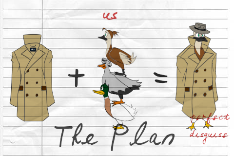
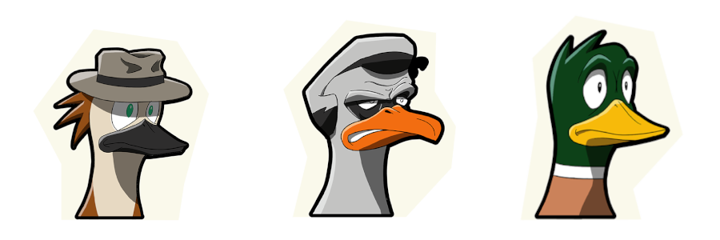

+++
title = 'Ducktective'
description = "J'ai travaillé sur cette démo de mon idée de jeu originale. Dans Duck-tective, vous incarnez trois canards sous un trench-coat et vous devez résoudre un mystère. Un projet comique avec un gameplay unique, et que j'ai entièrement écrit."
date = 2022-02-25T03:19:41+01:00
image = "thumb.png"
categories = ["Projets", "Portfolio"]
+++

Vous êtes-vous déjà demandé ce que cela ferait d'être trois canards empilés sous un trench-coat ? Non ? Eh bien, Duck-tective vous le montre quand même.

[Découvrez la page itch.io](https://kosmopol.itch.io/ducktective)

# Trailer



# Le concept

La plupart des jeux d'enquête se résument souvent à de l'exploration et à des associations d'idées très simples objet-situation ou à des questions fermées. C'était le cas du tout premier **Ace Attorney** que j'ai adoré. Et puis il y a une niche de jeux qui ne tiennent pas la main du joueur et le laissent comprendre réellement ce qu'il s'est passé. C'est le cas de **Return of the Obra Dinn** ou de **Detective Grimoire** qui ont été de grandes inspirations pour ce jeu. Quant à l'art et à l'univers, ils ont été fortement inspirés par le classique **Sam and Max**.

Dans Duck-tective, le défi n'est pas particulièrement l'exploration, mais plutôt la formulation d'hypothèses. Il y a une scène de crime, et pour rassembler des indices, vous devez équilibrer votre pile de canards tout en étant discret auprès des humains tout en restant incognito. L'interaction avec le monde a été inspirée par **Untitled Goose Game**.

Une fois les indices obtenus, le joueur doit faire un effort pour comprendre l'environnement dans lequel il a navigué. Pourquoi y a-t-il du verre brisé ici ? Que signifie cette trace ? Quels sont les personnages que j'ai rencontrés ? À partir de là, il utilise l'interface d'hypothèses pour formuler des hypothèses. **Celles-ci n'ont pas besoin d'être correctes, elles doivent simplement être valides**. Mais comme tout scientifique le sait, aucune hypothèse ne peut être validée sans une certaine **preuve**.

Cela conduirait alors l'histoire sur un chemin donné, soit une fausse piste, soit une bonne, qui sait.

# L'histoire

# L'histoire

Duck-tective se déroule dans un monde où les oiseaux sont intelligents et conscients mais le cachent aux humains. Pensez à **Toy Story** mais avec plus de... plumes. C'est ce qu'on appelle le Secret, celui qu'il faut à tout prix cacher aux humains. Pourquoi ? Imaginez que les humains partent en guerre contre les oiseaux, ils ont un avantage certain car les oiseaux n'ont pas de mains.

Le chef de la police des oiseaux, Pelicano, est appelé pour une affaire très particulière. Pour la première fois, **un oiseau a tué un humain**, ce qui menace le Secret. Afin de garder l'affaire aussi confidentielle que possible, il engage la meilleure équipe.

**Becky** est une jeune journaliste d'investigation que Pelicano a reconnu pour sa vivacité d'esprit. Elle est volontaire, courageuse, le genre de personnage "héros", pas question qu'elle échoue, n'est-ce pas ? n'est-ce pas ? Elle est déterminée à découvrir toute la vérité sur cette affaire.

**Barry** est un vieux policier qui approche de la retraite. Il a tout vu, et lorsqu'il fait équipe avec Becky, il voit la jeune fille motivée à l'extrême qu'elle est. Il veut juste que l'affaire soit classée, que le coupable soit derrière les barreaux, rien d'extraordinaire.

**Buck** C'est le fils adoptif de Pelicano. Il n'a pas le bec le plus pointu du troupeau, mais il a l'esprit le plus pur qui soit. Il est là parce que... Il n'y avait personne d'autre.

# Mes rôles dans le projet

* Game pitch, tout comme [Divunity](https://www.clemorl.fr/post/divunity/), j'ai amené l'idée devant mes collègues avec un concept de jeu brut et une vision claire. J'ai eu le plaisir de remplir le rôle de "game director" tout au long du développement.
* Conception des systèmes : j'ai travaillé sur le système d'hypothèses avec ma collègue [Léa](https://www.linkedin.com/in/lea-ropion/)
* Écriture : J'ai écrit l'histoire du jeu entière, ainsi que tous les messages et dialogues du jeu, à la fois en français et en anglais en parallèle.

Je voulais prendre du recul par rapport au prototypage et à la programmation et me concentrer sur ce que j'aime le plus : l'écriture. Comme nous étions une équipe de 9 personnes, j'ai pu le faire, mais nous avions aussi moins de temps. Je suis très fier de la façon dont le jeu s'est développé, mais tous les systèmes sont un peu approximatifs, nous n'avons pas pu consacrer plus de temps à l'itération. Développer le système d'hypothèses, améliorer l'interface utilisateur et l'expérience utilisateur ainsi que revoir les mouvements du personnage seraient mes priorités aujourd'hui.

# Les copains
La team incroyable qui a permis à Duck-tective de voir le jour

| [Pierre Aceituno](https://www.linkedin.com/in/pierre-aceituno-a5b8b2154/)   | Producer                          |
| [Guillaume David](https://www.linkedin.com/in/gd-dev/) | Gameplay Programmer |
| [Grégoire Monesma](https://www.linkedin.com/in/gr%C3%A9goire-monesma-71b042193/) | Sound & Music Designer |
|Clément Orlandini| Game Designer & Writer |
| [Solène Pobelle](https://www.linkedin.com/in/solene-pobelle/)    | Character and environment artist  |
| [Santiago Revetria](https://www.linkedin.com/in/santiago-revetria/) | Character artist |
| [Noé Simon](https://www.linkedin.com/in/noe-simon/)         | UX Designer, User Researcher      |
| [Clara Toussaint](https://www.linkedin.com/in/claratoussaint/) | UX Designer, UI Consultant |
| [Hugo Warion-Saillant](https://www.linkedin.com/in/hugo-ws/)| Gameplay Programmer |

# Les Documents

Tous les dialogues du jeu

