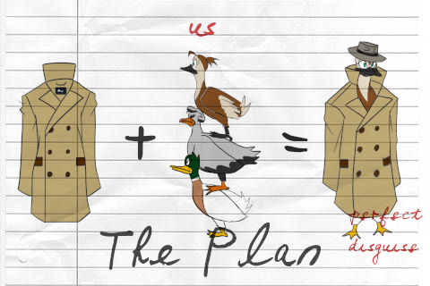
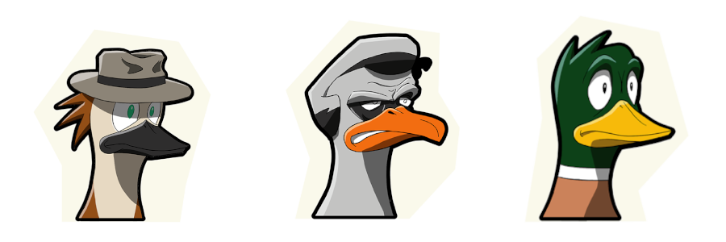

+++
title = 'Ducktective'
description = "I worked on this demo for my original game idea. In Duck-tective, you play as three ducks under a trench coat, and you have to solve a mystery. Will you quack the case? A comedy-filled project with a unique gameplay that I entirely wrote."
date = 2022-02-25T03:19:41+01:00
image = "thumb.png"
categories = ["Projects", "Portfolio"]
+++

Have you ever wondered what it would be like to be three ducks piled under a trench-coat? No? Well Duck-tective shows you anyways.

[Check out the itch.io page](https://kosmopol.itch.io/ducktective)

# Trailer



# The concept

Most mystery-solving games are often a lot of exploration and very basic object-to-situation connections or "yes or no" type of questions. This was the case of the very first **Ace Attorney** which I loved. And then there's a niche of games which don't hold the hand of the player and lets you figure out the mystery. This is the case of **Return of the Obra Dinn** or **Detective Grimoire** which were big inspirations for this game. As for the art and context, it was heavily inspired by the classic **Sam and Max** games.

In Duck-tective, the challenge is not particularly on exploring, but on **hypothesis making**. There is a crime scene, and to gather clues, you have to balance your pile of ducks while sneaking around humans while remaining incognito. The world interaction was inspired by **Untitled Goose Game**.

Once you got your clues, the player has to make an effort to understand the environment they navigated through. Why is there broken glass here? What does this trail mean? Which characters I met are relevant? From there, they use the hypothesis interface to formulate hypothesis. **They don't have to be correct, they just have to be valid**. But as every scientist knows, no hypothesis can be validated without some kind of **evidence.**

This would then lead the story on a given path, either a false trail or a right one, who knows.

# The Story

Duck-tective is set in a world where birds are intelligent and conscious but hide it from humans. Think **Toy Story** but with more... feathers. This is called The Secret, the one that should be kept from humans at all costs. Why? Well, imagine the humans went at war against the birds, they have a clear advantage as birds don't have hands.

Chief of the bird police Pelicano is called on a very unique case. For the very first time, **a bird killed a human**, this threatens the secret. In order to keep the case as confidential as possible, he hires the best team.

**Becky** is a young investigation journalist who Pelicano recognizes for her wits. She is forthcoming, courageous, basically the "hero" kind of character, no way she fails, right? right? She is focused on finding all the truth on this case.

**Barry** is an old policeman nearing his retirement. He has seen it all, and when he teams up with Becky, he sees the over-the-top motivated youth that she is. He just wants the case to be closed, the culprit to be behind bars, nothing fancy.

**Buck** He's Pelicano adoptive son. Not the cleanest beak in the flock, but the most pure-minded there is. He's there because... Well we found no one else.

# My roles on the project

* Game pitch, just like [Divunity](https://www.clemorl.fr/post/divunity/), I brought the idea in front of my colleagues with a crude game concept and a clear vision. I had the pleasure to fullfil this "game director" type of position throughout the development.
* Systems design : I worked on the hypothesis system with my friend [Léa]()
* Writing : I wrote the story for the entire game, which you can read below if you don't mind spoilers, as well as all the ingame prompts and dialogues, both in french and english in parallel.

I wanted to step back from prototyping and programming and focus on what I love most: writing. Because we were a team of 9, I could do that, but we also had less time. I'm very proud of how the game turned out, but all the systems do feel rough around the edges, we couldn't make more time for iteration. Expanding on the hypothesis system, improving the UI and the user experience as well as overhauling the character's movement would be my priority today.
# Friends
The incredible team that allowed Duck-tective to exist

|Crédit|Role|
|:----:|:--:|
| [Pierre Aceituno](https://www.linkedin.com/in/pierre-aceituno-a5b8b2154/)   | Producer                          |
| [Guillaume David](https://www.linkedin.com/in/gd-dev/) | Gameplay Programmer |
| [Grégoire Monesma](https://www.linkedin.com/in/gr%C3%A9goire-monesma-71b042193/) | Sound & Music Designer |
|Clément Orlandini| Game Designer & Writer |
| [Solène Pobelle](https://www.linkedin.com/in/solene-pobelle/)    | Character and environment artist  |
| [Santiago Revetria](https://www.linkedin.com/in/santiago-revetria/) | Character artist |
| [Noé Simon](https://www.linkedin.com/in/noe-simon/)         | UX Designer, User Researcher      |
| [Clara Toussaint](https://www.linkedin.com/in/claratoussaint/) | UX Designer, UI Consultant |
| [Hugo Warion-Saillant](https://www.linkedin.com/in/hugo-ws/)| Gameplay Programmer |
# The Documents

These are all the game's dialogues


