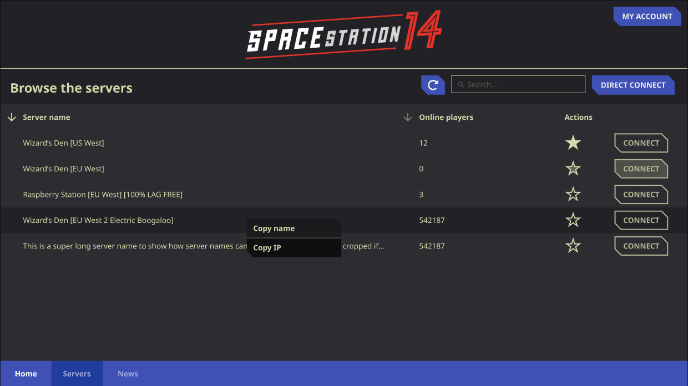
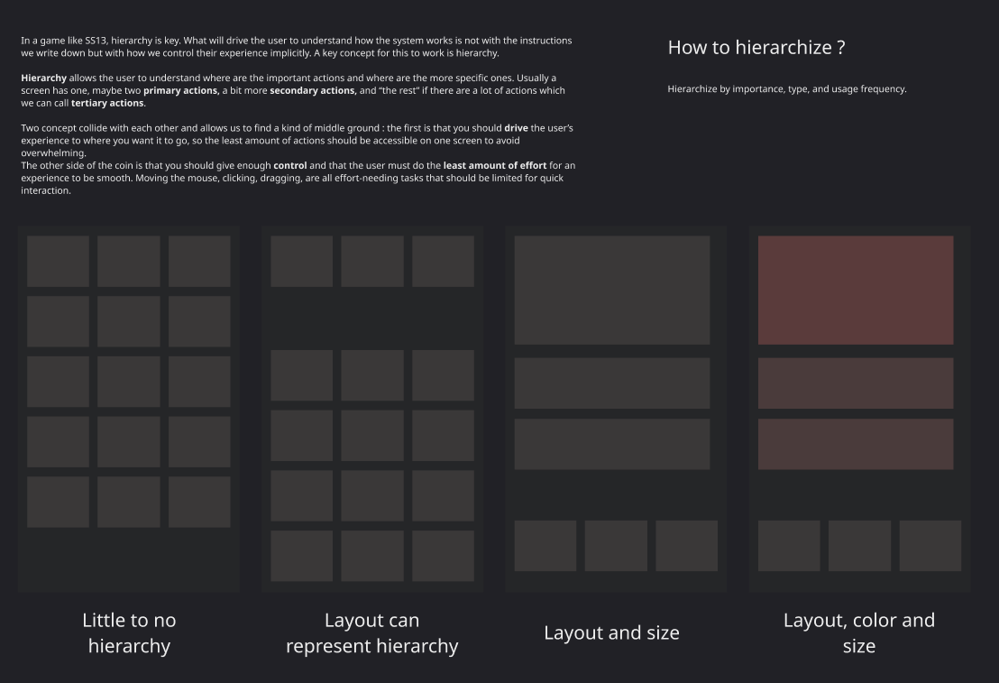
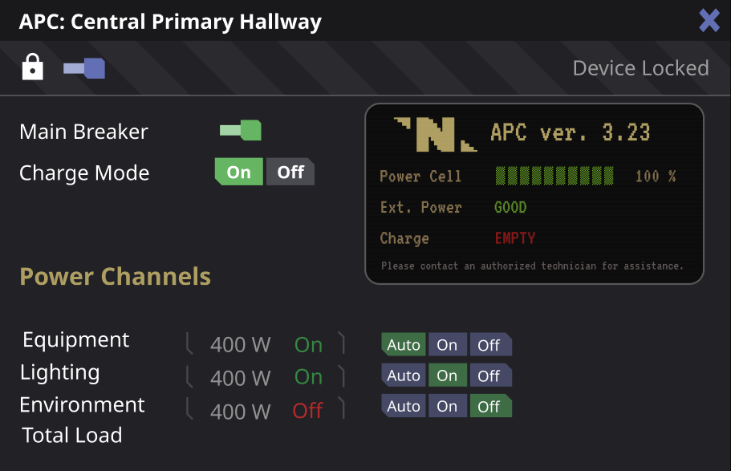
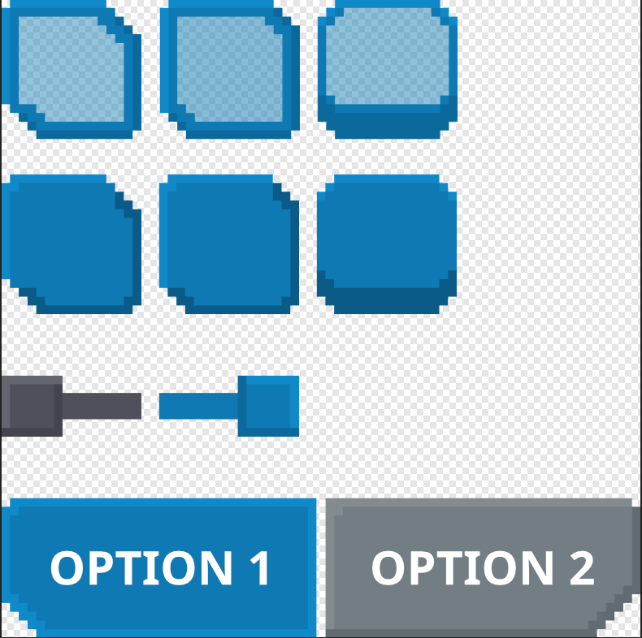
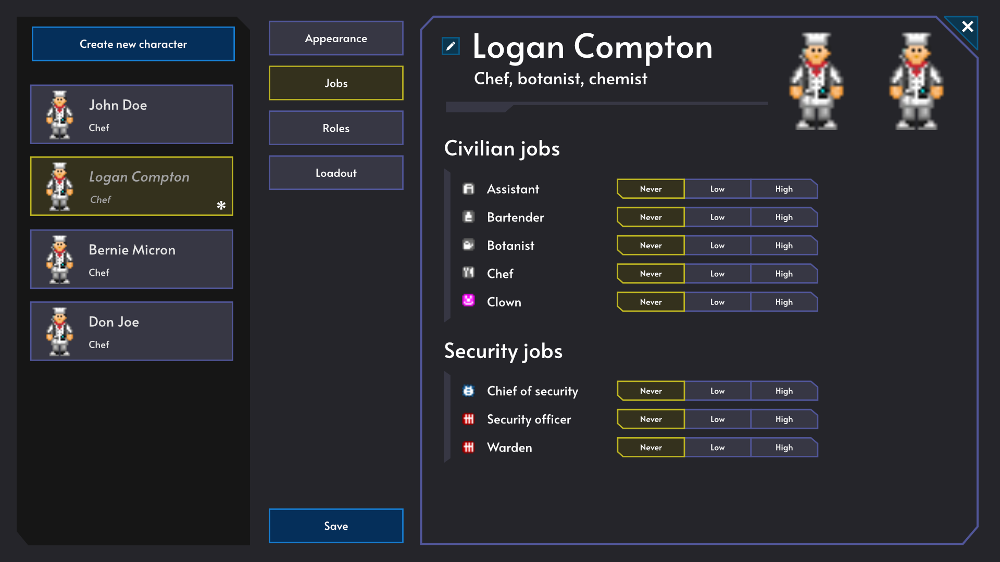
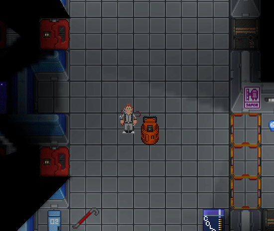
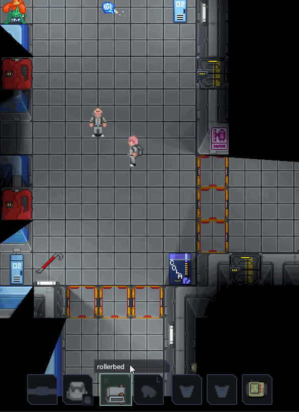
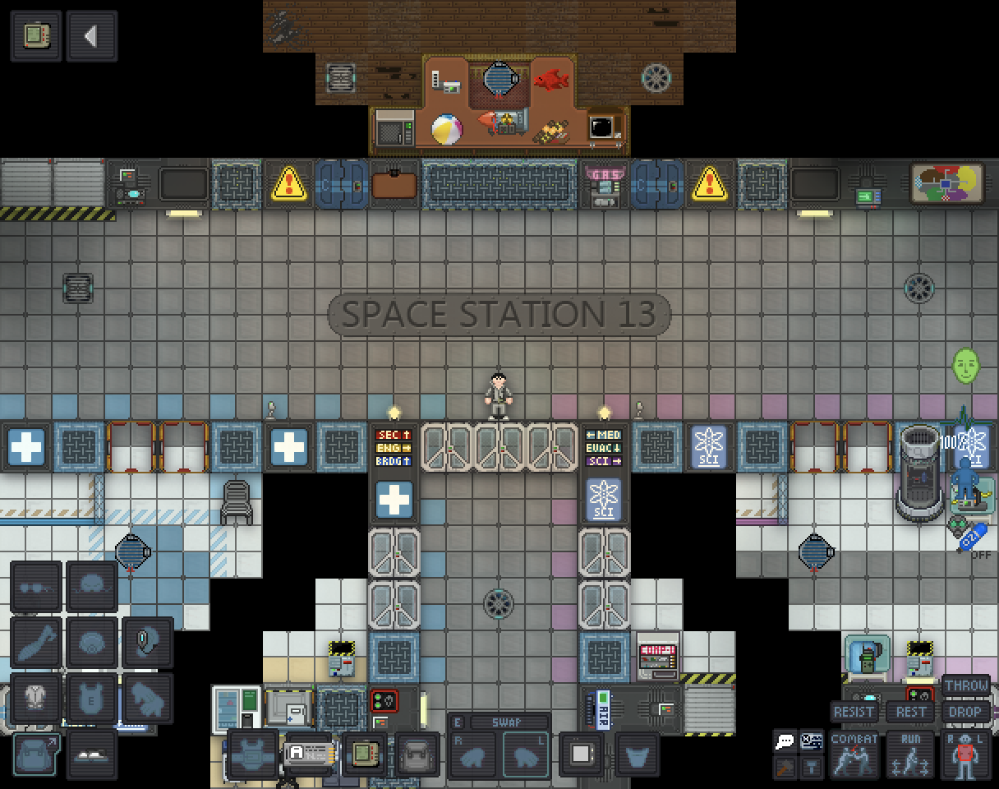
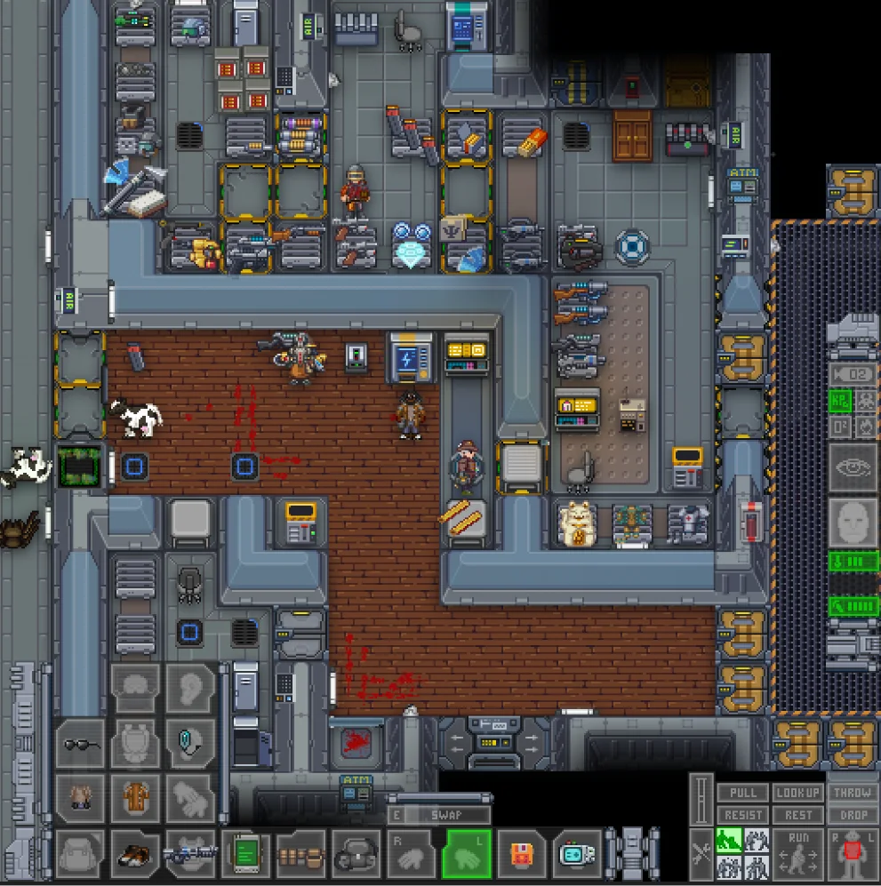
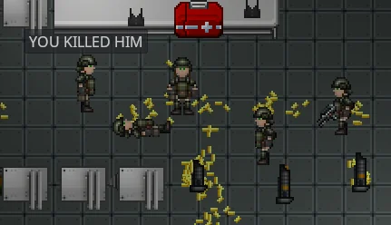

+++
title = 'Space Station 14'
desc = 'The infamous open-source multiplayer disaster simulator. I have contributed to this project for a long time now, and I still love it despite its flaws.'
categories = ['Open Source']
date = 2023-12-16T04:47:41+01:00
image="banner.jpg"
+++

Le site officiel de Space Station 14 indique :
**Space Station 14** raconte l'histoire d'une équipe ordinaire sur une station spatiale, où tout va mal tourner. Plongez dans votre rôle, jouez avec des systèmes détaillés et survivez au chaos dans ce jeu de rôle multijoueur en rounds.

C'est un résumé succinct pour nouveau venu, mais il ne rend pas justice à la bête gargantuesque qu'est le projet Space Station 14.

# Mon travail sur SS14

Si l'histoire ne vous intéresse pas, voici mon travail en quelques mots.

## Conception d'UI
J'ai réalisé quelques maquettes d'UI et j'ai rédigé un certain nombre de directives concernant le design d'UI.

      

## Mes "Pull Requests"

Ce que j'ai codé dans le jeu

- Ajout d'une limite de caractères dans le chat (ma toute première PR)
- Ajout de douilles vides qui tombent lorsqu'on tire avec des armes à feu.
- Ajout d'une interface pour les bidons de gaz
- Ajout de lits à roulettes et de fondations pour les véhicules
- Révision du fonctionnement des éviers en permettant aux joueurs de vider les liquides à l'intérieur et ajout de ventouses dans le jeu.

 

# Au début, il y avait 13

> Presque tout est possible, chaque tour est différent et tout le monde est fou. Et ce ne sont là que quelques-unes des raisons pour lesquelles j'aime Space Station 13".

**PC GAMER**

> "Un bac à sable multijoueur de science-fiction avec le même concept complètement fou du "plus c'est plus" que Dwarf Fortress."

**Rock, Paper, Shotgun** 

Dans SS13 (et donc 14, on y reviendra) vous pouvez **tout** faire. C'est un bazar de systèmes qui s'entremêlent, se complètent et fonctionne ensemble. Jouer un médecin pendant un round sera une expérience **totalement** différente de jouer un cuisinier ou bien un agent de sécurité, un clown etc. Vous pouvez même jouer des cyborgs, une IA et bien évidemment des races extra-terrestres.

Chaque partie, un ou plusieurs joueurs sont sélectionnés comme *antagoniste*, un rôle à part où le joueur aura des objectifs à remplir selon le mode de jeu. On peut par exemple citer les modes "Changelin" (inspiré de *The Thing*), "Culte", "Révolution", mais aussi "Nuclear Operatives" (des militaires surarmés essaient de s'infiltrer et de voler le disque nucléaire de la station) et des dizaines d'autres.



Vous avez l'idée. Space Station 13 a commencé en 2003 comme un simulateur d'atmosphère en 2D qui a été open-sourcé de force et est devenu un jeu multijoueur en bac à sable. Bien des années plus tard (2024 aujourd'hui, avec un peu de chance quelques années de plus à moins que la terre n'ait explosé), c'est devenu une communauté massive mais un peu secrète qui ne joue pas à un, mais à plusieurs jeux, étroitement liés et pourtant totalement différents.

Chaque serveur a sa propre codebase, et n'importe quel joueur peut simplement cliquer, rejoindre, et profiter d'une expérience unique de terreur, de folie et d'un peu d'amusement. Vous voulez profiter d'un jeu de rôle basique où on ne se prend pas la tête ? Rendez-vous sur tgstation. Vous pouvez également essayer l'histoire d'horreur unique avec un haut degré de RP qu'est CEV Eris. Si vous aimez tirer sur des extraterrestres, rendez-vous sur Colonial Marines.

*Le nombre 13 dans le titre est supposé être une référence au manque de chance de la station où il se passe beaucoup d'évènements innoportuns, car le nombre 13 est souvent un symbole de malchance.*

# Puis, il y a eu 14

SS13 est fait sur ce moteur de jeu horrible que tous les développeurs adorent détester et aiment pousser à sa limite, BYOND. Un groupe de personnes a donc commencé à travailler sur un remake afin de rendre le jeu plus facile à jouer, moins laggy, plus performant, et permettre une contribution au code plus facile dans un environnement de développement moderne.

Ils ont créé un moteur personnalisé en utilisant la bibliothèque standard .NET de Microsoft. Le projet est une bête, totalisant 3,7 milliers de lignes de code à l'heure actuelle. Pour permettre aux gens de contribuer à un projet de jeu vidéo d'une telle ampleur, des modèles de conception tels que ECS et Event Bus ont été utilisés, et cela fonctionne très bien.

Les décisions sont prises par une équipe de mainteneurs qui ne cesse de s'agrandir (des personnes qui contribuent très régulièrement au projet), et les gens sont encouragés à forker le jeu de base et à créer leurs propres communautés avec des perspectives de jeu uniques.

J'ai essayé une fois de créer une communauté française pour SS13, mais elle n'a pas vraiment décollé.