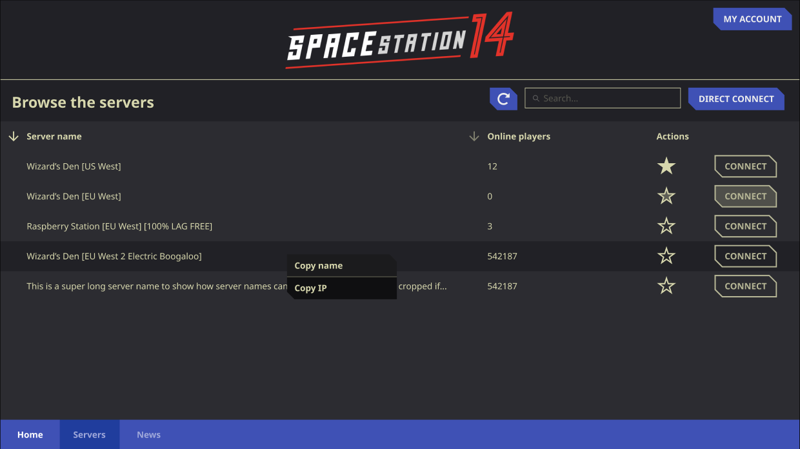
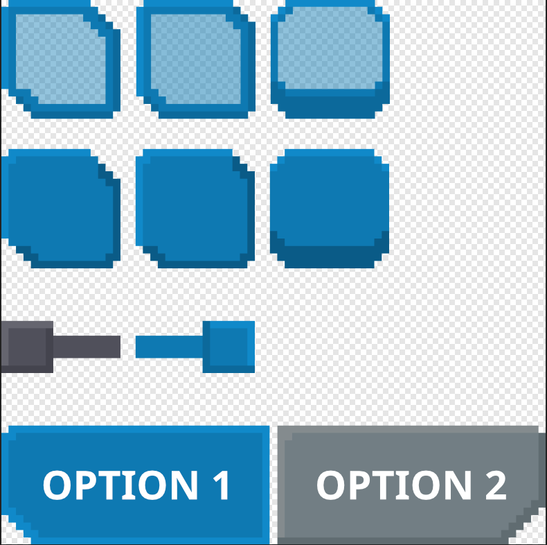
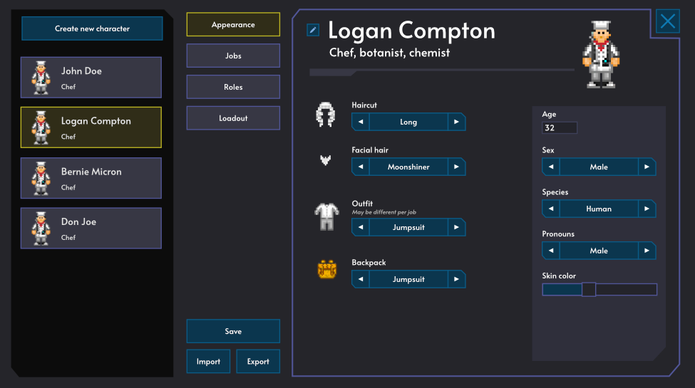
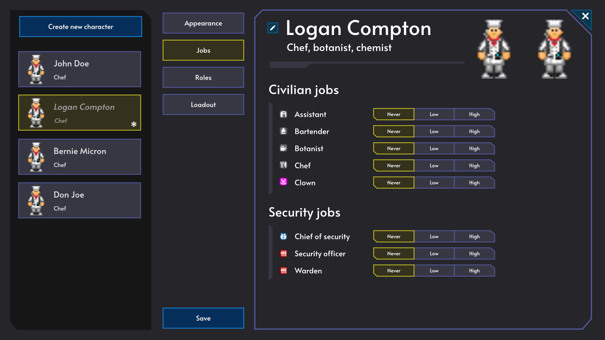
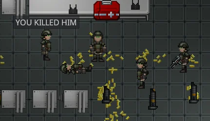

+++
title = 'Space Station 14'
desc = 'The infamous open-source multiplayer disaster simulator. I have contributed to this project for a long time now, and I still love it despite its flaws.'
categories = ['Open Source']
date = 2023-12-16T04:47:41+01:00
image="banner.jpg"
+++

The official website of Space Station 14 says:
> **Space Station 14** tells the story of an ordinary shift on a space station gone wrong. Immerse yourself into your role, tinker with detailed systems, and survive the chaos in this round-based multiplayer role playing game.

It's a succint summary for any newcomer but it doesn't make justice for the gargantuan beast of a project that is Space Station 14.

# My work on SS14

If you don't care about the story, here is my work in a nutshell.

## UI Design
I made some UI Design mockups and wrote a bunch of UI design guidelines.

      

## My Pull Requests
What I coded into the game

- Added a character limit to the chat (my very first PR)
- Added empty ammo shells dropping when shooting firearms
- Added gas canisters UI
- Added rollerbeds and groundwork for vehicles
- Overhauled how sinks worked by allowing players to empty liquids inside and added plungers to the game

 

# In the beginning, there was 13

> “Almost anything is possible, every round is different, and everyone is insane. And those are just some of the reasons I love Space Station 13.”
PC GAMER

>  “A sci-fi multiplayer sandbox with the same utterly batshit more-is-more design as Dwarf Fortress.”
Rock, Paper, Shotgun 

In SS13 (and therefore 14, we'll come back to that) you can do **anything**. It's a mess of systems that intertwine, complement and work together. Playing a doctor for a round will be a **totally** different experience from playing a cook or a security guard, a clown and so on. You can even play cyborgs, AI and, of course, alien races.

In each game, one or more players are selected as the *antagonist*, a separate role where the player will have objectives to fulfill, depending on the game mode. These include "Changelin" (inspired by *The Thing*), "Cult" and "Revolution" modes, as well as "Nuclear Operatives" (over-armed soldiers try to infiltrate and steal the station's nuclear disc) and dozens of others.



Translated with DeepL.com (free version)

You get the picture. Space Station 13 started in 2003 as a 2D atmospherics simulator that was force-open-sourced and became a sandbox multiplayer game. Many years later (2024 as of now, hopefully a few more years unless earth has exploded), it has become a massive yet kind of secret community that doesn't play one, but many games, closely related yet totally different.

Each server has its own codebase, and any player can just click, join, and enjoy a unique experience of terror, insanity and a little bit of fun. Wanna enjoy a low-roleplay sandbox shift? Go to tgstation. You can also try the unique high-roleplay horror story that is CEV Eris. Or maybe you like shooting aliens, then go to Colonial Marines.

*By the way, number 13 in the title is supposedly a reference to the mishaps that keep happening on the station, as the number 13 is often a symbol of ill-chance.*

# Then came 14

Thing is, SS13 is made on this god-awful game engine that every codebase maintainer love to hate and love to push to its limit called BYOND. So, a bunch of people started working on a remake in order to make the game easier to play, less laggy, more performant, and allow for easier code contribution in a modern development environment.

They created a custom engine using Microsoft's .NET standard library. The project is a beast, totalizing 3.7 thousand lines of code as of now. To allow people to contribute to such a big video game project, design patterns such as ECS and Event Bus were used, and it works really well.

Decisions are taken by an ever growing team of Maintainers (people who contribute very regularly on the project), and people are encouraged to fork the base game and create their own communities with unique gameplay perspectives.

I did once tried to create a french community for SS13, but it didn't really take off. 